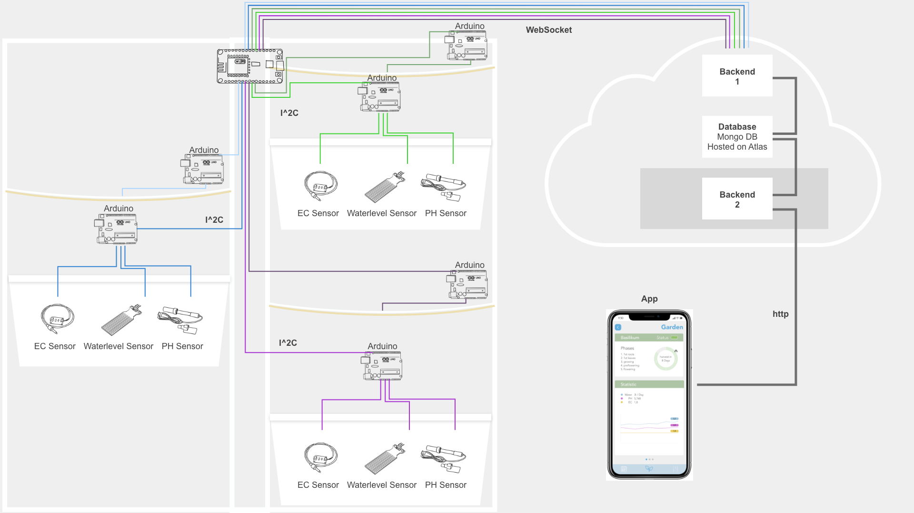

# plantarium

In unserem Projekt haben wir, innerhalb unseres Semesters an der Hochschule für Gestaltung Schwäbisch Gmünd, ein automatisiertes Hydroponisches Bewässerungssystem mit App entwickelt. Mit diesem System kann man Pflanzen schneller großziehen und die richtigen Nährstoffe für die Pflanzen dosieren.

Der Stack besteht aus:  
der mit Vue.js umgesetzten [App](https://github.com/maxicozy/plantarium-app),  
einem **Backend 2**, dass die Daten aus der Datenbank für die App bereitstellt,   
einem [Backend 1](https://github.com/maxicozy/plantarium-backend-i), dass die Daten aus dem Hydroponischen System in die Datenbank einspeist  
und aus den [Nodes](https://github.com/maxicozy/plantarium-nodes) die Sensordaten sammeln und die Hardware kontrollieren.  

Unser Prjektteam besteht aus:  
[Noah Mantel](https://github.com/Nodarida)  
[Ligia Dietze](https://github.com/Ligiki1)  
[Maximilian Becht](https://github.com/maxicozy)  
[Marius Schairer](https://github.com/marius220699)  

## plantarium-backend-i

Das zweite Backend holt Daten aus der Datenbank und stellt diese für das Frontend an verschiedenen Endpoints bereit

Die verschiedenen Datenendpoints sind:

#### GET /api/garden/

Dieser Endpoint sucht alle Einträge aus der Kollektion 'gardens' und fügt in jeden Garten mit `aggregate` die jeweiligen Module ein

#### GET /api/garden/:name

Dieser Endpoint funktioniert ähnlich wie der erste, er sucht aber nur nach einem Garten, dessen Name in der Anfrage spezifiziert ist. Außerdem fügt dieser Endpoint dem Modul abhängig von der im Modul angplfanzten Pflanze die `phases`, `percentGrown` und `harverstIn` Parameter aus der templateData Kollektion an. Diese können im Frontend als zusätzliche Informationen für den Nutzer angezeigt werden.

#### GET /api/garden/:name/:position/sensordata

Hier werden die Sensordaten eines Moduls mit einem in der Anfrage spezifizierten Position in einem in der Anfrage spezifizierten Garten abgefragt. Außerdem können mit einer query Sensordaten in einem bestimmten Zeitraum abgefragt werden mit dem Syntax  `?from=fromDate&to=toDate`. Hierbei ist `fromDate` das Datum ab dem die Sensordaten abgefragt werden sollen und `toDate` das Datum bis zu dem die Daten abgefragt werden sollen.
